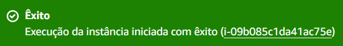
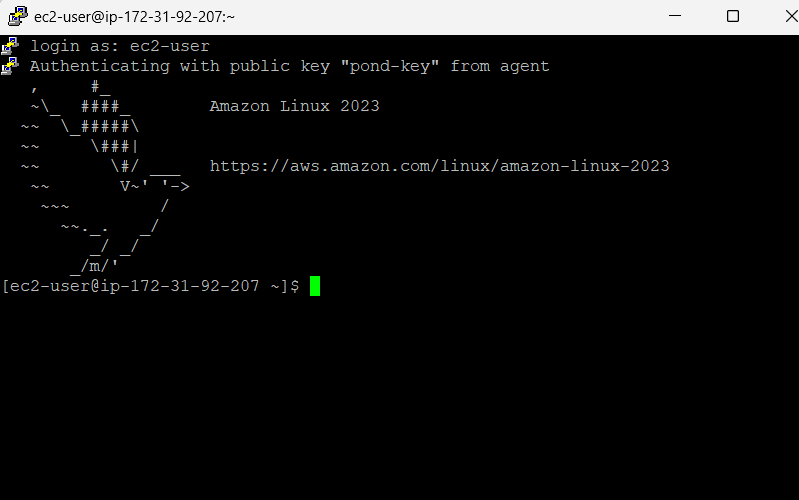

# ponderada_s3

## Introdução

Este relatório documenta o processo de criação e acesso a uma instância EC2 na AWS. O objetivo é demonstrar como lançar uma máquina virtual na nuvem e como se conectar a ela via SSH usando a ferramenta PuTTY.

## Objetivo

O objetivo deste projeto é estabelecer uma instância EC2 na AWS que possa ser acessada remotamente via SSH por meio do PuTTY, permitindo a execução de comandos como se estivesse fisicamente presente diante da máquina.

## Materiais

Para realizar a criação de uma instância de máquina EC2 na AWS e acessar esta máquina com SSH é necessário uma conta na AWS e instalação do PuTTY

## Método

### 1. Lançar uma Instância EC2

No console da AWS, comecei o processo de criação de uma nova instância EC2 chamada "pond"

### 2. Criação do par de chaves

Para assegurar uma conexão segura à instância EC2, criei um par de chaves denominado "pond-key", essencial para a autenticação. Selecionei o formato .ppk por ser o compatível com o Putty

### 3. Instância criada

Esta mensagem confirma que a instância foi lançada com sucesso. 

### 4. Endereço IPv4 Público

Na imagem acima é possível ver que a instância está executando e o endereço IPv4 público 3.93.220.239 é exibido. Este endereço é usado para acessar a instância via internet.

### 5. Configuração do PuTTY:

Esta é a janela de configuração do PuTTY. Aqui, a chave privada pond-key.ppk é especificada, este arquivo é necessário para que o PuTTY autentique o usuário de forma segura durante a tentativa de conexão SSH. O caminho do arquivo mostra onde a chave privada está armazenada localmente no computador do usuário.

### 6. Acesso SSH bem-sucedido

A imagem mostra a janela do terminal do PuTTY após a conexão SSH bem-sucedida. O usuário ec2-user é o login padrão e o texto "Authenticating with public key 'pond-key'" confirma que a autenticação com a chave pública associada à chave privada foi bem-sucedida. 

## Resultados

- Instância EC2 Criada
- Acesso SSH bem-sucedido
- Confirmação de Configuração e Acesso PuTTY

## Conclusão

Após seguir os procedimentos citados, estabeleci com sucesso uma instância na AWS e garanti o acesso remoto seguro via SSH utilizando o PuTTY. 